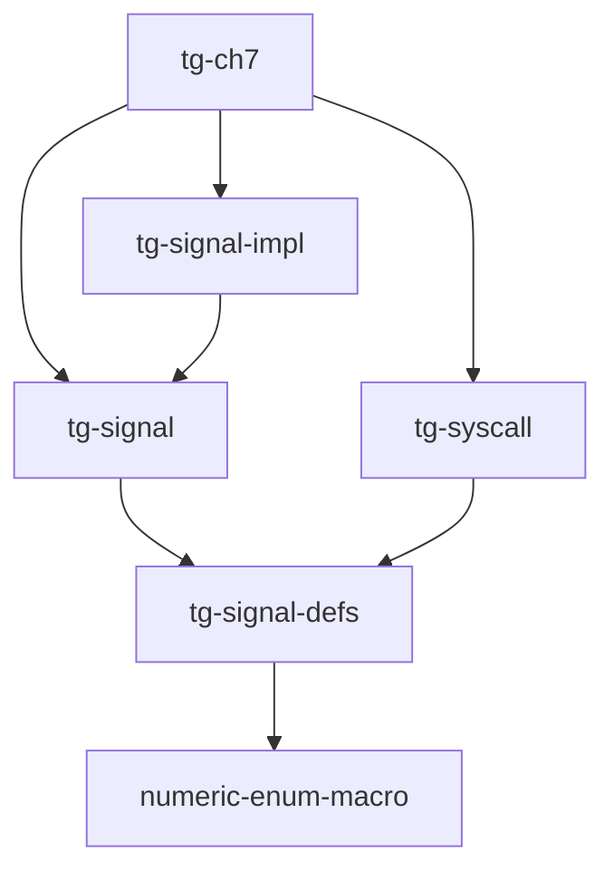

# 第七章：进程间通信与信号

本章实现了进程间通信机制，包括管道和信号处理。

## 功能概述

- 信号 (Signal) 机制处理异步事件
- 用户自定义信号处理函数的注册与调用
- 信号屏蔽字管理，控制信号的接收
- 在系统调用返回前检查并处理待处理信号
- 管道 (Pipe) 实现进程间单向数据传递
- 文件、管道和标准输入输出都通过统一的文件描述符类型管理

## 用户程序加载

用户程序存储在 easy-fs 磁盘镜像中，内核启动时挂载文件系统，通过文件名从文件系统加载。

## 新增或更新的系统调用

| 系统调用 | 功能 |
|----------|------|
| `pipe` | 创建管道，返回读端和写端文件描述符 |
| `kill` | 向指定进程发送信号 |
| `sigaction` | 设置信号处理函数 |
| `sigprocmask` | 设置信号屏蔽字 |
| `sigreturn` | 从信号处理函数返回，恢复原执行流 |
| `read` | 读取文件/管道/标准输入 |
| `write` | 写入文件/管道/标准输出 |

## 信号处理

信号允许异步通知进程发生了某个事件。每个进程维护待处理信号集合和信号处理函数表。

本章内核在系统调用返回前检查并处理待处理信号。

```rust
match task.signal.handle_signals(ctx) {
    // 收到终止信号，进程应该结束执行
    SignalResult::ProcessKilled(exit_code) => unsafe {
        (*processor).make_current_exited(exit_code as _)
    },
    _ => // ...
```

## 管道

管道是一对文件描述符，一端写入、另一端读取，用于父子进程间通信：

```rust
fn pipe(&self, pipe_fd: usize) -> isize {
    let (read_end, write_end) = make_pipe();
    // ...
    // pipe_fd[0] = 读端 fd, pipe_fd[1] = 写端 fd
    current.fd_table.push(Some(Mutex::new(Fd::PipeRead(read_end))));
    current.fd_table.push(Some(Mutex::new(Fd::PipeWrite(write_end))));
    0
}
```

管道由 `tg-easy-fs` 中的 `make_pipe()` 创建，内部使用环形缓冲区实现数据传递。

## 关键依赖：tg-signal 与 tg-signal-impl

信号机制由多个 crate 协作实现，依赖关系如下：



- **tg-signal-defs**：信号基础定义（`SignalNo`、`SignalAction`），依赖 `numeric-enum-macro` 生成枚举
- **tg-signal**：定义 `Signal` trait 和 `SignalResult`，重导出 `tg-signal-defs` 的类型
- **tg-signal-impl**：提供 `Signal` trait 的参考实现 `SignalImpl`
  ```rust
  pub struct SignalImpl {
      received: SignalSet,                    // 已收到的信号（位图）
      mask: SignalSet,                        // 信号屏蔽字
      handling: Option<HandlingSignal>,       // 正在处理的信号状态
      actions: [Option<SignalAction>; MAX_SIG + 1],  // 信号处理函数表
  }
  ```
- **tg-syscall**：系统调用定义，依赖 `tg-signal-defs` 获取信号类型

进程通过 `Box<dyn Signal>` 持有信号处理器，支持 fork 时继承信号配置。

## Dependencies

| 依赖 | 说明 |
|------|------|
| `virtio-drivers` | virtio 块设备驱动 |
| `xmas-elf` | ELF 文件解析 |
| `riscv` | RISC-V CSR 寄存器访问 |
| `tg-sbi` | SBI 调用封装库 |
| `tg-linker` | 链接脚本生成、内核布局定位 |
| `tg-console` | 控制台输出 (`print!`/`println!`) 和日志 |
| `tg-kernel-context` | 用户上下文及异界传送门（启用 `foreign` feature） |
| `tg-kernel-alloc` | 内核内存分配器 |
| `tg-kernel-vm` | 虚拟内存管理 |
| `tg-syscall` | 系统调用定义与分发 |
| `tg-task-manage` | 进程管理框架（启用 `proc` feature） |
| `tg-easy-fs` | 简单文件系统及管道实现 |
| `tg-signal` | 信号模块定义 |
| `tg-signal-impl` | 信号模块参考实现 |

## Features

| Feature | 说明 |
|---------|------|
| `nobios` | 无需外部 SBI 实现，直接从 QEMU `-bios none` 模式启动 |

## License

Licensed under either of MIT license or Apache License, Version 2.0 at your option.
